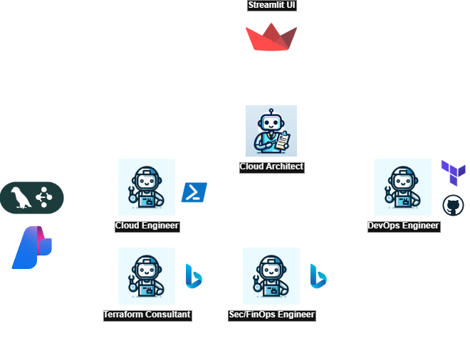

# 🤖 IaP (Infrastructure as Prompts) Agent

<p align="center">
    
</p>

## 🎯 Goal

Transform cloud infrastructure deployment from complex command-line operations to simple conversational requests. Demonstrates how AI agents interpret natural language requirements and automatically provision Azure resources through an intelligent multi-agent system with built-in compliance validation.

## ✨ Key Features

- 🎯 **Supervisor Agent Orchestration** - Intelligent workflow planning and multi-agent coordination
- 🏗️ **Terraform Template Generation** - Production-ready infrastructure from natural language
- ⚖️ **Compliance Validation** - Real-time checking against PCI DSS, HIPAA, SOX, GDPR, ISO 27001
- 💰 **Azure Cost Estimation** - Automatic cost analysis with detailed breakdowns
- 📊 **Real-Time Logging** - Beautiful console output showing agent activities
- 👥 **Human-in-the-Loop** - Mandatory approval workflow for governance

## 🔧 Setup

### Prerequisites
- Azure AI Foundry Project, including at least one OpenAI chat model deployment
- Grounding with Bing Search resource in Microsoft Azure, connected to said Azure AI Foundry Project

1. **Install dependencies**:
   ```bash
   poetry install
   ```

2. **Configure Azure AI Foundry Connections** (Create `.env` file in the base directory):
   - OpenAI Endpoint: **AZURE_OPENAI_ENDPOINT**
   - OpenAI Deployment: **AZURE_OPENAI_DEPLOYMENT**
   - API key: **AZURE_OPENAI_API_KEY**
   - API version: **AZURE_OPENAI_API_VERSION**
   - Foundry Project Endpoint: **AZURE_PROJECT_ENDPOINT**
   - Bing Search Service Connection for Foundry Project: **BING_CONNECTION**

3. **Run Streamlit Web Interface**:
   ```bash
   poetry run python run_app.py
   ```

## 🏗️ Architecture

<p align="center">
    
</p>

### Agent Responsibilities
- **🎯 Cloud Architect Agent**: Orchestrates workflow, validates results and communicates with users
- **🏗️ Cloud Engineer Agent**: Generates infrastructure templates
- **🔍 Terraform Research Agent**: Looks up documentation and best practices
- **⚖️ SecOps/FinOps Agent**: Validates against security frameworks and calculates costs
- **🚀 DevOps Agent**: Deploys templates to the cloud

## 📊 Performance Metrics

| Feature | Traditional | AI-Powered | Improvement |
|---------|-------------|------------|-------------|
| **Time to Deploy** | 2-3 days | 5-10 minutes | 99% faster |
| **Compliance Coverage** | 60-70% | 95%+ | 40% improvement |
| **Configuration Errors** | 20-30% | <5% | 85% reduction |
| **Cost Optimization** | Manual research | Automated analysis | 10x faster |
